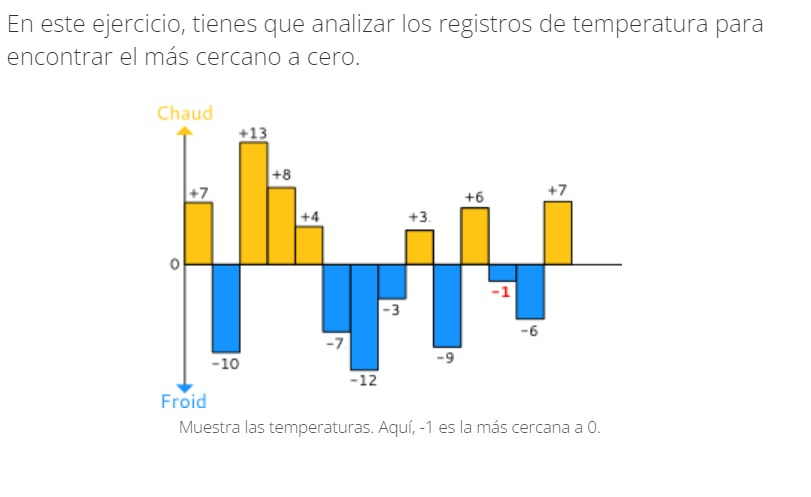

# Mas_cercano_a_Cero__Python
## En este ejercicio de entrevista técnica, tienes que analizar los registros de temperatura para encontrar el más cercano a cero.
### Implementa compute_closest_to_zero(ts), función que toma un arreglo de temperaturas ts y devuelve la temperatura más cercana a 0.

### Restricciones:

- Si el arreglo está vacío, tu función debe devolver 0
0 ≤ ts tamaño ≤ 10000
- Si dos temperaturas son igualmente cercanas a cero, debe ser devuelta la temperatura positiva.
Por ejemplo, si la entrada es -5 y 5, entonces se debe devolver 5.
1. El resultado es correcto con un conjunto de datos simple: {7 5 9 1 4} -> 1
Problem solving
**+70pts**
2. Funciona cuando solo está el -273
Problem solving
**+20pts**
3. Funciona cuando solo está el 5526
Problem solving
**+20pts**
4. Funciona cuando la entrada contienen solo números negativos: {-15 -7 -9 -14 -12} -> -7
Problem solving
**+35pts**
5. Funciona con dos temperaturas negativas que sean iguales: {-10 -10} -> -10
Problem solving
**+35pts**
6. La solución muestra 0 si no hay temperatura
Problem solving
**+35pts**
7. Cuando dos temperaturas son iguales de cercanas a 0, entonces gana la positiva: {15 -7 9 14 7 12} -> 7
Problem solving
**+85pts**

